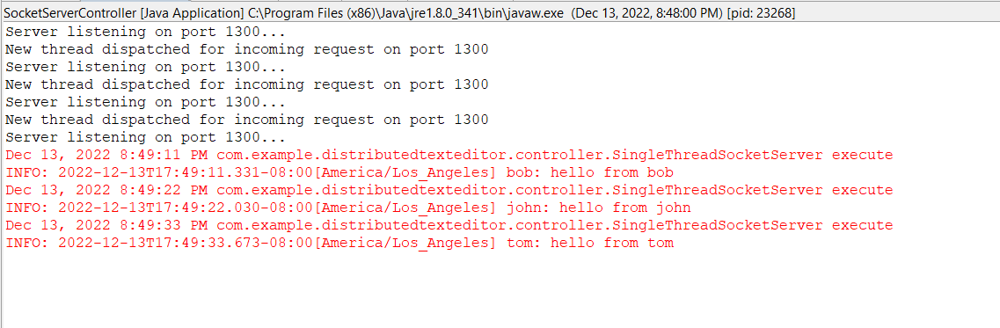

# Group chat applcation

### How to run

* open up ide of choice (intellij or eclipse)
* First we need to run SocketServerController.java, this starts the server.
* Next start TestClient.java, to connect it to the server.
* Similarly start TestClienttwo.java and TestClientThree.java.
* Now, We need to enter username for all the clients.
* Once the usernames are entered, all the client can enter any message.
* Any message entered is displayed to all other clients and hence communicate in group.

### Screenshots

