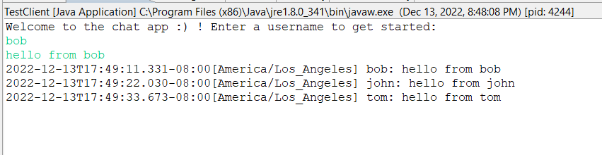
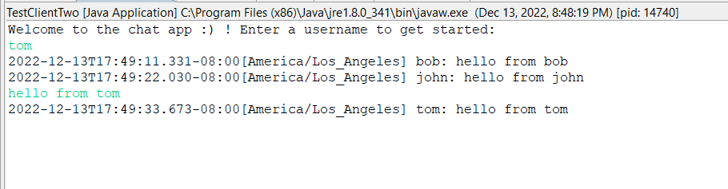
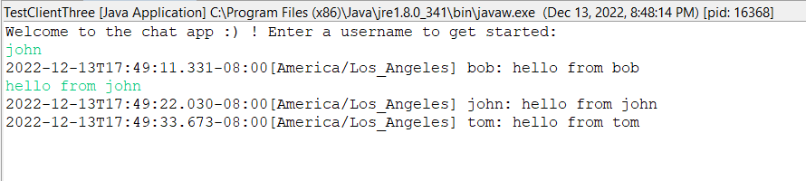

## Real-Time, Multi-threaded Chat Application

### Key Links:
1. Video: https://northeastern-my.sharepoint.com/:v:/g/personal/ezumah_k_northeastern_edu/EfBoMoR-RR5Ph8meNW8r4XcBmuv8CUz9vvXgn7qZu4_G6g?e=59jngx
2. Project Report: https://docs.google.com/document/d/1wh0BVyzVsziflSiMHCAS8UoTWYgYaa6uCwgYVWPdd94/edit#

### How to run

* open up ide of choice (intellij or eclipse)
* First we need to run SocketServerController.java, this starts the server.
* Next start TestClient.java, to connect it to the server.
* Similarly start TestClienttwo.java and TestClientThree.java.
* Now, We need to enter username for all the clients.
* Once the usernames are entered, all the client can enter any message.
* Any message entered is displayed to all other clients and hence communicate in group.

### Screenshots

* Here is the server, It shows everytime a client gets connected, It also shows the logs.

* This is the first client, it shows all the messages sent by other by other clients.

* This is the second client, it is similar to client 1.

* Last one is the third client.

